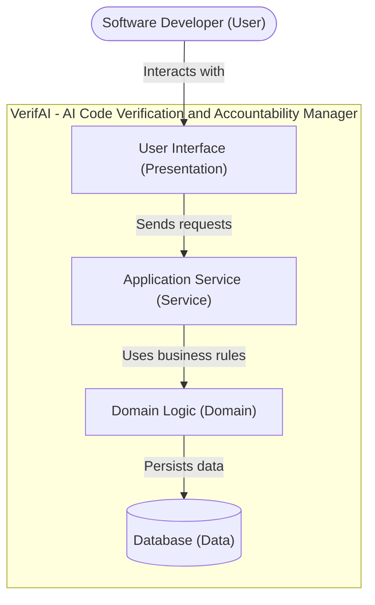
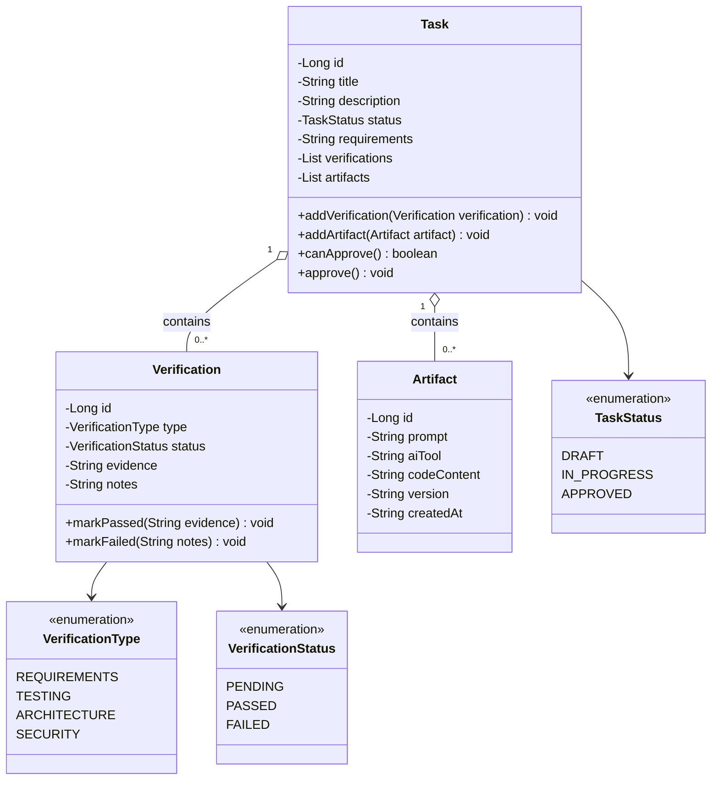
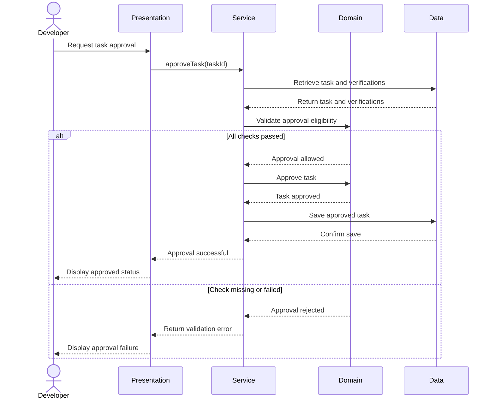

# VerifAI: AI Code Verification & Accountability Manager

<!-- CI badge: after Session 4, replace ORG/REPO and the workflow filename, then uncomment:

-->

**Student:** Alejandro Santana · **Course:** CEN 5064 Software Design, Fall 2026 · **Partner:** [@dquin144]

## Project Description

AI coding assistants allow developers to produce software faster, but they also create a growing need to verify that AI-generated code actually satisfies its requirements, passes appropriate tests, and fits the architecture of the project. VerifAI is a lightweight system designed for software developers who use AI coding assistants and want a structured way to verify and document their AI-assisted work before it is committed. The system will allow developers to define development tasks and acceptance criteria, record AI-generated code and its associated prompts, perform and track verification checks such as requirements, testing, architecture, and security reviews, and maintain an auditable history of verification results and human approval. The goal is to provide developers with a repeatable workflow for moving AI-generated code from generation → verification → correction → approval, while maintaining human accountability for the final implementation.

**Core Features**
- <ins>Task & Specification Management</ins>: Create development tasks with descriptions, requirements, and acceptance criteria that define what the implementation must accomplish.
- <ins>AI Artifact Tracking</ins>: Record AI-generated code, prompts, AI tools, and implementation versions associated with each development task.
- <ins>Verification & Testing</ins>: Track verification checks covering requirements, functionality, testing, architecture, code quality, and security, including the results of automated tests where applicable.
- <ins>Review & Accountability</ins>: Manage the approval workflow and maintain a history of verification results and revisions. A task cannot be approved unless every required verification check has been individually marked as **PASSED**, ensuring that approval represents a completed verification process rather than simply a recorded status.

## How to run

```
[Exact commands to build and run your system from a clean clone.
Update this every time the steps change — your partner and your
instructor will follow it literally on conference days.]
```

## Architecture

### Tier breakdown (Session 2 studio)

| Tier | Responsibilities in THIS system |
|------|--------------------------------|
| Presentation | Displays tasks, AI-generated artifacts, verification checks, and approval status. Collects user input and sends requests to the Service tier. It does not make business decisions or access the database directly. Likely components: `TaskController`, `VerificationController`, `ArtifactController` |
| Service | Receives requests from the Presentation tier and coordinates the steps needed to complete operations such as creating a task, recording an AI artifact, submitting a verification result, or requesting approval. Likely components: `TaskService`, `VerificationService`, `ArtifactService` |
| Domain | Contains the core concepts, state, and business rules of the system. Determines whether a task can transition between states and enforces the task approval rule: a task cannot be marked as **APPROVED** unless every required verification check (requirements, testing, architecture, and security) has been individually marked as **PASSED**. Likely components: `Task`, `Verification`, `Artifact` |
| Data | Handles communication with the single relational database and persists tasks, AI-generated artifacts, verification checks, verification results, and task status. When an approved task is saved, the Data tier stores the state determined by the Domain. Does NOT decide whether the task is eligible for approval. Likely components: `TaskRepository`, `VerificationRepository`, `ArtifactRepository`  |

### C4 — Context & Container (Session 3 studio)

```mermaid
%% Replace this placeholder with YOUR system's context diagram.
flowchart LR
    developer(["Software Developer<br/><small>&#40;User&#41;</small>"])
    system["VerifAI<br/><small>&#40;System&#41;</small>"]

    developer -->|Manages tasks & verifies code| system
    system -->|Tracks & enforces approval| developer
```





### UML — Class & Sequence (Session 3 studio)





## Architecture Decision Records

Decisions live in [`docs/adr/`](docs/adr/). Start with ADR-001 in Session 4.

| # | Decision | Status |
|---|----------|--------|
| [001](docs/adr/adr-001.md) | [What I am building and why] | [proposed] |

## Weekly log (optional but recommended)

A one-line note per week keeps your commit story readable:

- Week 1 (Aug 24): Repository created; brainstormed and evaluated potential project ideas based on personal interest, feasibility, and course scope.
- Week 2 (Aug 31): Project Approved. Defined four core features, established the Presentation → Service → Domain → Data architecture, and documented the approval constraint requiring all verification checks to pass before a task can be approved.
- Week 3 (Sep 7): Labor Day Recess
- Week 4 (Sep 14): Developed VerifAI's architectural and design models, including the C4 Context and Container diagrams and UML Class and Sequence diagrams. Refined the responsibilities of the Presentation, Service, Domain, and Data tiers, defined the relationships between Task, Verification, and Artifact, and documented the approval workflow requiring all verification checks to pass before approval. Created GitHub issues for the project's core use cases and implementation tasks.
- Week 5 (Sep 21): Created GitHub issues for VerifAI's core use cases and supporting development tasks. Organized the implementation plan around task management, AI artifact tracking, verification and testing, the approval workflow, layered architecture, database persistence, testing/CI, and the user interface.
